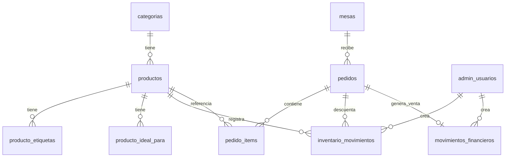

# Fresquitox — Base de datos PostgreSQL

Reemplaza el almacenamiento actual en `localStorage` por una base de datos compartida entre:

- Panel admin (`/admin/dashboard`)
- Pedidos por QR de mesa (`/mesa/:numero`)
- Catálogo público (`/productos`)
- Eventos (`/eventos`)

## Requisitos

- PostgreSQL 14+ (compatible con Supabase, Neon, Railway, Docker local)

## Instalación rápida

```bash
# 1. Crear base de datos
createdb fresquitox

# 2. Ejecutar esquema + datos iniciales
psql -d fresquitox -f schema.sql
psql -d fresquitox -f seed.sql
psql -d fresquitox -f views_reportes.sql
```

O en un solo paso:

```bash
psql -d fresquitox -f install.sql
```

## Diagrama relacional



## Módulos

| Módulo | Tablas principales | Reemplaza |
|--------|-------------------|-----------|
| **Productos** | `categorias`, `productos`, `producto_etiquetas`, `producto_ideal_para` | `fq_admin_productos` + `servicios.data.ts` |
| **Inventario** | `inventario_movimientos` + `productos.stock_actual` | campos `stock` / `stockMinimo` |
| **Pedidos** | `mesas`, `pedidos`, `pedido_items` | `fq_mesas`, `fq_pedidos` |
| **Eventos** | `eventos` | `fq_eventos` |
| **Reportes** | `movimientos_financieros` + vistas | `fq_reportes` |

## Convenciones

- **Precios**: enteros en COP (`precio_cop`), sin decimales. Ej: `8000` = $8.000
- **IDs públicos**: texto (`slug`, `ev1`) para compatibilidad con el frontend actual
- **Timestamps**: `TIMESTAMPTZ` en UTC; el frontend convierte a hora Colombia
- **Soft delete**: productos y eventos usan `activo = false` en lugar de borrar filas

## Flujo de pedido + inventario

1. Cliente en `/mesa/1` crea pedido → `INSERT pedidos` + `pedido_items` (estado `pendiente`)
2. Admin mueve kanban → `UPDATE pedidos.estado`
3. Al marcar `entregado`, el trigger `trg_pedido_entregado`:
   - Descuenta stock (`inventario_movimientos` tipo `venta`)
   - Crea ingreso en `movimientos_financieros` (categoría `venta`)

## Vistas de reportes

| Vista | Uso |
|-------|-----|
| `v_resumen_mensual` | Ingresos, gastos, balance por mes |
| `v_gastos_por_categoria` | Desglose de gastos |
| `v_ventas_diarias` | Ventas por día (desde pedidos entregados) |
| `v_inventario_alertas` | Productos agotados o bajo mínimo |
| `v_pedidos_activos` | Kanban del dashboard |

## Próximo paso (API)

Conectar Angular a la BD vía REST en `server.ts` o Supabase client:

```
GET    /api/productos
POST   /api/pedidos
PATCH  /api/pedidos/:id/estado
GET    /api/eventos
GET    /api/reportes/resumen?mes=2026-06
POST   /api/inventario/movimiento
```

## Usuario admin inicial

| Usuario | Contraseña (cambiar en producción) |
|---------|-----------------------------------|
| `admin` | `admin123` |

Hash incluido en `seed.sql` (bcrypt). En producción usar variables de entorno.
